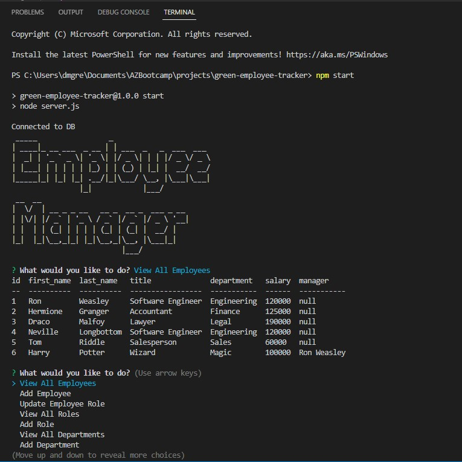

# green-employee-tracker

## Description
This project is to create an employee tracker using the command terminal. This was done using a sql2 and inquire package. I created a connection.js file to creat the connection and put my user information in. I created a schema file for the tables and a seeds file for the data. The server.js file I made the questions, switch case statement, and the functions needed to run the application. I made a package.json file for the npm install. After the install you can run the program by typing npm start in the terminal. A list then appear with options to view all emplyees, add employees, view all roles, add role, view all departments, add department, and quit. The user can select any of the options and they will give you prompts and based of the responses the table will update. 
## Table of contents
- [Mock-up](#Mock-up)
- [Installation](#Installation)
- [Usage](#Usage)
- [Contribution](#Contributing)
- [Test](#Test)
- [Questions](#Questions)
- [Diployment Links](#Questions)
## Mock-up

## Installation
npm install

inquirer

mysql2

console.table
## Usage
mysql -u root -p
In mysql source db/schema.sql then source db/seeds.sql
npm start
## Contributing
Steven Green
## Test
npm run test
## Questions
GitHub Username: [mrgreen12375](https://github.com/mrgreen12375)

Email Address: [ste2144105@gmail.com](ste2144105@gmail.com)
## Deployment Links
Screencastify: https://drive.google.com/file/d/1sHQ2o0dyDrQp-DhCHNIpf_eTgqVM3aTs/view

GitHub Repo: https://github.com/mrgreen12375/green-employee-tracker